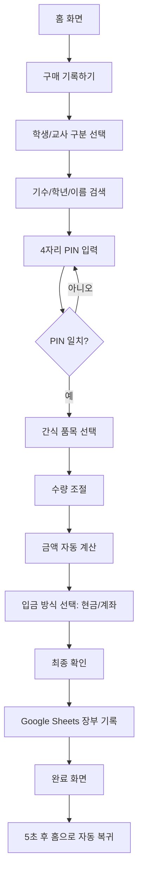
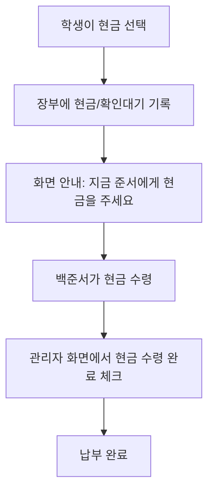
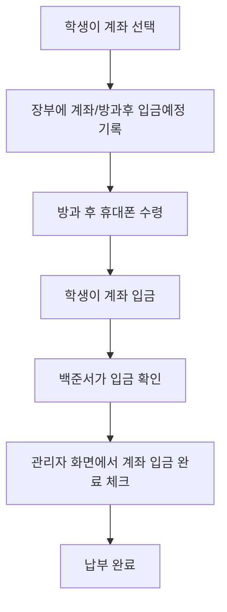

# 넥스트챌린지스쿨 내부 매점 웹사이트 PRD v4

작성일: 2026-06-11  
프로젝트명: **NCS Snack Kiosk / 넥스트챌린지스쿨 매점 장부**  
버전: **v4 — Lenovo Tab M9 세로형 키오스크 UI, 공기계 정산기 운영 확정**

---

## 1. 한 줄 정의

**Lenovo Tab M9를 세로로 세워둔 공기계 정산기에서 학생·교사가 이름을 선택하고 PIN을 입력한 뒤 간식 품목과 입금 방식을 고르면, 이름·품목·금액·입금 방식·납부 상태가 Google Sheets 장부에 즉시 자동 기록되는 넥스트챌린지스쿨 내부 매점 시스템.**

---

## 2. 이번 요청으로 확정된 핵심 방향

기존 구상은 “각자 휴대폰으로 접속해 구매 기록”에 가까웠지만, 실제 운영 환경상 학생들이 수업 시작 후 휴대폰을 제출한다. 따라서 MVP는 **개인 휴대폰 기반 서비스가 아니라 Lenovo Tab M9 공기계 1대를 매점 정산기처럼 세로로 세워두고 운영하는 키오스크형 웹앱**으로 설계한다.

### 운영 방식 요약

1. 매점 근처에 공기계 또는 태블릿을 1대 둔다.
2. 학생·교사는 간식을 가져가기 전 또는 가져간 직후 정산기에서 기록한다.
3. 정산기에서 다음 항목을 입력한다.
   - 이름
   - 구매 품목
   - 자동 계산된 금액
   - 입금 방식: `현금` 또는 `계좌`
4. 현금 선택 시 학생은 바로 백준서에게 현금을 전달한다.
5. 계좌 선택 시 학생은 방과 후 휴대폰을 받은 뒤 입금한다.
6. 모든 기록은 Google Sheets 장부에 즉시 반영되어 선생님이 확인할 수 있다.
7. 백준서는 관리자 화면에서 현금 수령, 계좌 입금 확인, 미납 상태를 체크한다.

---

## 3. 해결하려는 문제

현재 방식은 수기 장부이기 때문에 다음 문제가 있다.

| 문제 | 설명 | 시스템 해결 방식 |
|---|---|---|
| 이름/품목/금액 오기입 | 손으로 적다 보니 글씨가 애매하거나 가격 계산이 틀릴 수 있음 | 이름 선택, 품목 버튼 선택, 금액 자동 계산 |
| 구매 기록 누락 | 바쁠 때 장부를 안 쓰고 가져갈 수 있음 | 공기계를 매점 앞에 고정 배치하고 구매 플로우를 10초 이내로 단축 |
| 비용 회수 어려움 | 후불 정산 시 누가 얼마를 냈는지 추적이 어려움 | Google Sheets에 구매/납부/미납 자동 정리 |
| 계좌 입금 지연 | 학생들이 수업 중 폰을 못 써서 즉시 이체가 어려움 | 계좌 선택 시 `방과후 입금 예정`으로 기록 |
| 현금 확인 부담 | 현금을 실제로 받았는지 나중에 헷갈림 | 관리자에서 `현금 수령 완료` 체크 |
| 도용 가능성 | 남의 이름으로 장부를 적을 수 있음 | 이름 선택 후 4자리 결제 PIN 입력 |
| 선생님 확인 어려움 | 선생님이 장부를 보려면 따로 정리해야 함 | Google Sheets 장부/요약 탭 자동 업데이트 |

---

## 4. 제품 목표

### MVP 목표

- 학생·교사가 **회원가입 없이** 공기계에서 구매 기록을 남길 수 있다.
- 구매 플로우는 **10~15초 안에 완료**되어야 한다.
- 이름, 품목, 금액, 입금 방식이 장부에 자동으로 들어간다.
- 간식 가격은 품목 선택만 하면 자동으로 따라온다.
- 결제 방식은 `현금`과 `계좌` 두 가지로 시작한다.
- Google Sheets에 실시간으로 기록되어 선생님이 확인할 수 있다.
- 백준서는 관리자 화면에서 품목 수정, 정산 확인, 미납자 확인을 할 수 있다.
- 학생별 4자리 PIN으로 남의 이름 도용을 막는다.

### 비목표

MVP에서 아래 기능은 필수 구현 대상이 아니다.

- 카드 결제, 토스페이, 카카오페이 자동 결제
- 계좌 입금 자동 대조
- 복잡한 회원가입/로그인
- 학생 개인 앱 설치
- 재고 자동 발주
- 완전 자동 문자 독촉

단, **미납 문자 발송**은 추후 확장 기능으로 설계만 열어둔다.

---

## 5. 사용자 유형

| 사용자 | 대상 | 사용 기기 | 주요 행동 |
|---|---|---|---|
| 학생 | NCS 학생 | 매점 공기계 | 이름 선택, PIN 입력, 간식 선택, 입금 방식 선택, 구매 기록 |
| 교사 | NCS 교사 | 매점 공기계 / Google Sheets | 간식 구매, 장부 확인 |
| 관리자 | 백준서 | 관리자 PC/폰/공기계 | 품목 관리, 현금 수령 확인, 계좌 입금 확인, 미납 확인, 장부 수정 |
| 확인자 | 선생님 | Google Sheets | 오늘 장부, 개인별 미납, 현금/계좌 내역 확인 |

---

## 6. 공기계 키오스크 운영 정책

### 6.1 기기 배치

- 매점 또는 간식 보관 위치 옆에 공기계 1대를 고정한다.
- 웹사이트를 홈 화면에 추가하여 앱처럼 실행한다.
- 화면은 모바일 세로 기준으로 설계한다.
- 브라우저 주소창이 보이지 않도록 PWA 설치를 권장한다.

### 6.2 공기계에서 반드시 필요한 UX

- 글자가 크고 버튼이 커야 한다.
- 한 손으로 빠르게 누를 수 있어야 한다.
- 이름 검색이 빨라야 한다.
- 구매 완료 후 자동으로 처음 화면으로 돌아가야 한다.
- 일정 시간 입력이 없으면 자동 초기화되어야 한다.
- 이전 사람의 구매 내역이나 미납 정보가 다음 사람에게 노출되지 않아야 한다.

### 6.3 자동 초기화 정책

| 상황 | 동작 |
|---|---|
| 15초 동안 입력 없음 | 홈 화면으로 복귀 |
| 구매 완료 후 5초 경과 | 홈 화면으로 복귀 |
| PIN 5회 오류 | 해당 이름 1분 잠금 또는 관리자 확인 안내 |
| 동기화 실패 | 로컬 임시 저장 후 재시도, 화면에는 `기록 대기 중` 표시 |

### 6.4 Lenovo Tab M9 세로형 키오스크 UI 기준

운영 기기는 **Lenovo Tab M9**를 기준으로 한다. 태블릿은 매점 옆에 세로 거치하고, 웹앱은 PWA로 홈 화면에 추가해 앱처럼 실행한다. Lenovo Tab M9의 디스플레이는 9인치, 800 × 1340 해상도 기준이므로, UI는 **모바일보다 여유 있지만 PC처럼 복잡하지 않은 세로형 태블릿 레이아웃**으로 설계한다.

#### 화면 설계 원칙

| 원칙 | 설명 |
|---|---|
| 세로 고정 우선 | 기본 사용 방향은 portrait이며, landscape 최적화는 후순위 |
| 한 화면 한 목적 | 이름 선택, PIN 입력, 품목 선택, 입금 방식 선택을 한 화면에 섞지 않음 |
| 큰 터치 영역 | 주요 버튼 높이 64~72px, 최소 터치 영역 48px 이상 |
| 하단 고정 CTA | `다음`, `구매 기록 완료`는 항상 하단 고정 영역에 배치 |
| 10초 구매 | 이름 선택부터 완료까지 10~15초 안에 끝나야 함 |
| 자동 복귀 | 완료 후 5초 뒤 홈으로 돌아가 다음 사람이 바로 사용 |
| 개인정보 최소 노출 | 완료 화면에는 구매 결과만 짧게 보여주고, 이전 사람 내역을 남기지 않음 |
| 관리자 분리 | 관리자 버튼은 작게 하단에 두고, 관리자 비밀번호 없이는 접근 불가 |

#### 추천 레이아웃 수치

| 항목 | 권장값 |
|---|---|
| 전체 컨테이너 | `min-height: 100dvh`, 가운데 정렬 |
| 콘텐츠 최대 너비 | `max-width: 720px` |
| 좌우 여백 | 24px |
| 상단 헤더 높이 | 72px 내외 |
| 주요 버튼 높이 | 64~72px |
| 상품 카드 | 2열 그리드, 카드 높이 96~112px |
| 이름 버튼 | 2~3열 그리드, 높이 56~64px |
| 하단 결제 바 | 화면 하단 sticky, 총액 + 다음 버튼 표시 |
| 완료 화면 표시 시간 | 5초 후 자동 홈 복귀 |

#### 시각 스타일

- 배경: 거의 흰색 또는 아주 연한 회색
- 카드: 흰색, 둥근 모서리, 얇은 회색 테두리
- 강조색: 파란색 계열 1개만 사용
- 현금/계좌 선택: 두 개의 큰 카드형 버튼으로 구분
- 경고/미납/실패: 빨간색은 정말 필요한 곳에만 사용
- 텍스트: 검정에 가까운 진회색, 과한 장식 금지
- 애니메이션: 버튼 눌림, 완료 체크 정도만 짧게 사용

#### 태블릿 운영 설정

| 항목 | 권장 설정 |
|---|---|
| 설치 방식 | PWA 홈 화면 추가 |
| 화면 방향 | 세로 고정 권장 |
| 거치 방식 | 충전 케이블 연결 가능한 세로 거치대 |
| 화면 꺼짐 | 가능하면 길게 설정, 앱에서는 Wake Lock API 지원 시 사용 |
| 브라우저 UI | PWA standalone 모드로 주소창 최소화 |
| 분실/오작동 방지 | Android 화면 고정 또는 키오스크 모드 검토 |

---

## 7. 구매 플로우

### 7.1 기본 구매 플로우



### 7.2 구매 화면에서 기록되는 값

구매자는 실제 장부를 손으로 쓰는 대신 아래 정보를 버튼으로 입력한다.

| 항목 | 입력 방식 |
|---|---|
| 이름 | 명단에서 선택 또는 검색 |
| 품목 | 간식 버튼 선택 |
| 금액 | 품목 가격 기준 자동 계산 |
| 입금 방식 | `현금` 또는 `계좌` 버튼 선택 |
| 구매 시간 | 시스템 자동 기록 |
| 납부 상태 | 입금 방식에 따라 자동 설정 |

---

## 8. 입금 방식별 처리 정책

### 8.1 현금 선택 시

학생이 `현금`을 선택하면 구매 기록은 즉시 장부에 들어가지만, 납부 완료로 확정되지는 않는다. 백준서가 실제로 현금을 받은 뒤 관리자 화면에서 확인한다.



#### 현금 상태값

| 상태 | 의미 |
|---|---|
| `현금 확인대기` | 학생이 현금으로 내겠다고 기록함 |
| `현금 수령완료` | 백준서가 실제 현금을 받음 |
| `미납` | 마감 시간이 지났는데 수령 확인이 안 됨 |

### 8.2 계좌 선택 시

학생이 `계좌`를 선택하면 구매 기록은 장부에 들어가고, 상태는 `방과후 입금예정`이 된다. 학생은 방과 후 휴대폰을 받은 뒤 입금한다. 백준서는 입금 내역을 확인한 뒤 관리자 화면에서 납부 완료 처리한다.



#### 계좌 상태값

| 상태 | 의미 |
|---|---|
| `방과후 입금예정` | 계좌로 내겠다고 기록했지만 아직 입금 확인 전 |
| `계좌 입금완료` | 백준서가 계좌 입금을 확인함 |
| `미납` | 정산 마감 후에도 입금 확인이 안 됨 |

### 8.3 정산 마감 정책

- 기본 마감 기준은 **종례 전 장부 기록 완료**이다.
- 계좌 입금은 학생들이 방과 후 휴대폰을 받은 뒤 처리할 수 있으므로, 납부 확인은 방과 후 또는 저녁에 이뤄질 수 있다.
- 장부 기록 마감과 실제 납부 완료 마감은 분리한다.

| 기준 | 의미 |
|---|---|
| 장부 기록 마감 | 종례 전까지 구매 내역을 모두 기록해야 함 |
| 현금 수령 마감 | 가능하면 구매 직후 백준서에게 바로 현금 전달 |
| 계좌 입금 마감 | 방과 후 휴대폰 수령 후 당일 입금 권장 |
| 미납 판정 | 관리자가 정한 마감 시점 이후 미확인 건 |

---

## 9. 정보구조 IA

```text
홈
├─ 구매 기록하기
│  ├─ 학생/교사 선택
│  ├─ 기수/학년/이름 선택
│  ├─ PIN 입력
│  ├─ 간식 선택
│  ├─ 입금 방식 선택
│  └─ 구매 완료
│
├─ 내 장부 확인
│  ├─ 이름 선택
│  ├─ PIN 입력
│  ├─ 최근 구매 내역
│  └─ 미납/입금대기 금액
│
├─ 간식 제안
│  ├─ 이름 선택
│  ├─ 제안 품목 입력
│  └─ 제출 완료
│
└─ 관리자
   ├─ 관리자 비밀번호 입력
   ├─ 오늘 장부
   ├─ 현금 확인대기
   ├─ 계좌 입금대기
   ├─ 미납자 목록
   ├─ 간식 품목 관리
   ├─ 명단 관리
   └─ Google Sheets 동기화 상태
```

---

## 10. 핵심 화면 설계

### 10.1 홈 화면

```text
┌─────────────────────────┐
│ NCS 매점 장부            │
│                         │
│ [구매 기록하기]          │
│ [내 장부 확인]           │
│ [간식 제안]              │
│                         │
│ 관리자                   │
└─────────────────────────┘
```

### 10.2 이름 선택 화면

```text
┌─────────────────────────┐
│ 이름을 선택하세요         │
│ [검색: 이름 입력]         │
│                         │
│ [학생] [교사]             │
│ [1기] [2기] [3기] [4기]   │
│ [고2] [고1] [중3] [중2]   │
│                         │
│ 김안석  백준서  황준민    │
│ 정휘람  김민재  박은우    │
└─────────────────────────┘
```

### 10.3 PIN 입력 화면

```text
┌─────────────────────────┐
│ 백준서님 맞나요?          │
│ 결제 비밀번호 4자리 입력  │
│                         │
│ ● ● ○ ○                 │
│                         │
│ [1] [2] [3]              │
│ [4] [5] [6]              │
│ [7] [8] [9]              │
│ [←] [0] [확인]           │
└─────────────────────────┘
```

### 10.4 간식 선택 화면

```text
┌─────────────────────────┐
│ 간식을 선택하세요         │
│                         │
│ 피크닉        700원   [+] │
│ 웜즈 구미     300원   [+] │
│ 몬스터 망고 1,800원   [+] │
│ 맥반석 계란   700원   [+] │
│ 허니버터칩  1,500원   [+] │
│ 이클립스      800원   [+] │
│ 초코파이      500원   [+] │
│                         │
│ 선택 금액: 2,500원        │
│ [다음]                   │
└─────────────────────────┘
```

### 10.5 입금 방식 선택 화면

```text
┌─────────────────────────┐
│ 입금 방식을 선택하세요     │
│                         │
│ 총 금액: 2,500원          │
│                         │
│ [현금]                   │
│ 지금 준서에게 현금 전달    │
│                         │
│ [계좌]                   │
│ 방과 후 폰 받고 입금       │
│                         │
│ [구매 기록 완료]          │
└─────────────────────────┘
```

### 10.6 완료 화면

```text
┌─────────────────────────┐
│ 기록 완료                │
│                         │
│ 이름: 김안석              │
│ 품목: 피크닉 x1, 초코파이 x1│
│ 금액: 1,200원             │
│ 방식: 계좌                │
│ 상태: 방과후 입금예정      │
│                         │
│ Google Sheets 반영 완료   │
│ 5초 후 처음 화면으로 이동  │
└─────────────────────────┘
```

### 10.7 Lenovo Tab M9 세로형 실제 화면 구성

Lenovo Tab M9를 세로 거치했을 때는 화면이 길기 때문에, 상단에는 현재 단계와 안내 문구를 두고, 중간에는 선택 영역, 하단에는 다음 행동 버튼을 고정한다.

#### 홈 화면

```text
┌──────────────────────────────────┐
│ NCS 매점 정산기                  │
│ 오늘도 가져가기 전에 기록하기     │
│                                  │
│ ┌──────────────────────────────┐ │
│ │        구매 기록하기          │ │
│ │ 이름 → PIN → 품목 → 입금방식  │ │
│ └──────────────────────────────┘ │
│                                  │
│ ┌──────────────┐ ┌────────────┐ │
│ │ 내 장부 확인 │ │ 간식 제안   │ │
│ └──────────────┘ └────────────┘ │
│                                  │
│ 오늘 기록 12건 · 동기화 정상      │
│                                  │
│                         관리자    │
└──────────────────────────────────┘
```

#### 이름 선택 화면

```text
┌──────────────────────────────────┐
│ 1/4 이름 선택                    │
│ 누가 구매하나요?                 │
│ ┌──────────────────────────────┐ │
│ │ 이름 검색                     │ │
│ └──────────────────────────────┘ │
│ [학생] [교사]                    │
│ [1기] [2기] [3기] [4기] [고2]    │
│                                  │
│ ┌────────┐ ┌────────┐ ┌───────┐ │
│ │ 김안석 │ │ 백준서 │ │ 황준민│ │
│ └────────┘ └────────┘ └───────┘ │
│ ┌────────┐ ┌────────┐ ┌───────┐ │
│ │ 정휘람 │ │ 김민재 │ │ 박은우│ │
│ └────────┘ └────────┘ └───────┘ │
│                                  │
│ [처음으로]                       │
└──────────────────────────────────┘
```

#### 품목 선택 화면

```text
┌──────────────────────────────────┐
│ 3/4 품목 선택                    │
│ 김안석님, 가져간 간식을 고르세요 │
│                                  │
│ ┌──────────────┐ ┌────────────┐ │
│ │ 피크닉        │ │ 몬스터     │ │
│ │ 700원     +  │ │ 1,800원 + │ │
│ └──────────────┘ └────────────┘ │
│ ┌──────────────┐ ┌────────────┐ │
│ │ 초코파이      │ │ 허니버터칩 │ │
│ │ 500원     +  │ │ 1,500원 + │ │
│ └──────────────┘ └────────────┘ │
│                                  │
│ 선택: 피크닉 x1, 초코파이 x1      │
│ ┌──────────────────────────────┐ │
│ │ 총 1,200원              다음 │ │
│ └──────────────────────────────┘ │
└──────────────────────────────────┘
```

#### 입금 방식 화면

```text
┌──────────────────────────────────┐
│ 4/4 입금 방식                    │
│ 총 1,200원                       │
│                                  │
│ ┌──────────────────────────────┐ │
│ │ 현금                          │ │
│ │ 지금 바로 준서에게 주기        │ │
│ └──────────────────────────────┘ │
│                                  │
│ ┌──────────────────────────────┐ │
│ │ 계좌                          │ │
│ │ 방과 후 폰 받고 입금하기       │ │
│ └──────────────────────────────┘ │
│                                  │
│ ┌──────────────────────────────┐ │
│ │ 구매 기록 완료                │ │
│ └──────────────────────────────┘ │
└──────────────────────────────────┘
```

---

## 11. 관리자 화면 요구사항

### 11.1 관리자 인증

- 관리자: **백준서**
- 관리자 모드는 별도 버튼 또는 `/admin` 경로로 진입한다.
- 관리자 비밀번호는 코드에 직접 적지 않고 환경변수로 관리한다.
- 추후 필요하면 선생님용 읽기 전용 비밀번호를 별도로 둘 수 있다.

### 11.2 관리자 대시보드

관리자는 매일 장부를 수기로 계산하지 않고 아래 정보를 한눈에 확인한다.

| 카드 | 내용 |
|---|---|
| 오늘 총 구매액 | 오늘 기록된 전체 구매 금액 |
| 현금 확인대기 | 현금 선택 후 아직 수령 확인 안 된 금액/인원 |
| 계좌 입금대기 | 계좌 선택 후 아직 입금 확인 안 된 금액/인원 |
| 납부 완료 | 오늘 또는 이번 정산 기간 납부 완료 금액 |
| 미납 예상 | 확인대기 + 입금대기 중 마감 지난 금액 |
| 최근 기록 | 최근 구매 기록 20건 |

### 11.3 정산 처리 기능

관리자는 다음 작업을 할 수 있어야 한다.

- 현금 수령 완료 체크
- 계좌 입금 완료 체크
- 구매 기록 취소
- 구매 기록 수정
- 여러 건 일괄 납부 완료 처리
- 특정 학생/교사 검색
- 오늘/이번주/이번달 필터
- 미납자만 보기
- Google Sheets 동기화 상태 확인

### 11.4 관리자 정산 테이블 예시

```text
┌─────────────────────────────────────────────┐
│ 오늘 장부                                    │
├──────┬────────┬───────┬──────┬─────────────┤
│ 시간 │ 이름   │ 품목  │ 금액 │ 상태        │
├──────┼────────┼───────┼──────┼─────────────┤
│ 10:21│ 김안석 │ 피크닉│ 700  │ 계좌 입금대기│
│ 10:25│ 백준서 │ 몬스터│1800  │ 현금 확인대기│
└──────┴────────┴───────┴──────┴─────────────┘

[선택 건 현금 수령 완료]
[선택 건 계좌 입금 완료]
[선택 건 취소]
```

---

## 12. 선생님 확인용 Google Sheets 구조

선생님이 확인해야 하는 핵심은 복잡한 웹 관리자 화면보다 **엑셀처럼 정리된 장부**이다. 따라서 Google Sheets를 사실상 선생님용 확인 화면으로 사용한다.

### 12.1 Google Sheets 탭 구성

| 탭 이름 | 목적 | 선생님 확인 여부 |
|---|---|---|
| `ledger` | 전체 구매 장부 원본 | 확인 가능 |
| `daily_summary` | 날짜별 매출/입금/미납 요약 | 확인 가능 |
| `member_summary` | 사람별 구매액/납부액/미납액 | 확인 가능 |
| `cash_pending` | 현금 수령 확인이 필요한 건 | 확인 가능 |
| `transfer_pending` | 계좌 입금 확인이 필요한 건 | 확인 가능 |
| `products` | 간식 품목/가격 | 관리자 수정 |
| `members` | 학생/교사 명단 | 관리자 수정 |
| `suggestions` | 간식 제안 | 관리자 확인 |
| `settings` | 운영 설정 | 관리자 전용 |

### 12.2 `ledger` 탭 컬럼

요청사항인 `이름, 품목, 금액, 입금방식`이 반드시 보이도록 한다.

| 컬럼 | 예시 | 설명 |
|---|---|---|
| `purchase_id` | p_20260611_0001 | 구매 고유 ID |
| `timestamp` | 2026-06-11 10:21:33 | 구매 시각 |
| `date` | 2026-06-11 | 구매 날짜 |
| `member_type` | 학생 | 학생/교사 |
| `cohort` | 3기 | 학생 기수 |
| `grade` | 고2 | 학년/구분 |
| `name` | 김안석 | 구매자 이름 |
| `items` | 피크닉 x1, 초코파이 x1 | 품목 요약 |
| `total_amount` | 1200 | 총 금액 |
| `payment_method` | 계좌 | 현금/계좌 |
| `payment_status` | 방과후 입금예정 | 현재 납부 상태 |
| `confirmed_by` | 백준서 | 수령/입금 확인자 |
| `confirmed_at` | 2026-06-11 17:40:00 | 확인 시각 |
| `note` | - | 비고 |
| `synced_at` | 2026-06-11 10:21:34 | 시트 반영 시각 |

### 12.3 `member_summary` 탭 컬럼

| 컬럼 | 설명 |
|---|---|
| `name` | 학생/교사 이름 |
| `member_type` | 학생/교사 |
| `cohort` | 기수 |
| `grade` | 학년 |
| `purchase_total` | 정산 기간 구매 총액 |
| `paid_total` | 납부 완료 처리된 금액 |
| `pending_cash` | 현금 확인대기 금액 |
| `pending_transfer` | 계좌 입금대기 금액 |
| `unpaid_total` | 최종 미납 금액 |
| `last_purchase_at` | 마지막 구매 시각 |
| `last_payment_at` | 마지막 납부 확인 시각 |

---

## 13. 학생/교사 명단

### 13.1 학생 명단

| 기수 | 학년/구분 | 이름 | 성별/비고 | 상태 |
|---|---|---|---|---|
| 1기 | 고2/고1 | 황서영 | 여 | 재학 |
| 1기 | 고2/고1 | 신주원 | 여 | 재학 |
| 1기 | 고2/고1 | 이승준 | - | 재학 |
| 1기 | 중3/고3/20살 | 황승현 | 학년 확인 필요 | 재학 |
| 2기 | 고2 | 강지호 | - | 재학 |
| 2기 | 고2 | 김성겸 | - | 재학 |
| 2기 | 고2 | 김재성 | - | 재학 |
| 2기 | 고2 | 안가범 | - | 재학 |
| 2기 | 고1 | 김루아 | - | 재학 |
| 2기 | 고1 | 이지훈 | - | 재학 |
| 2기 | 고1 | 김나윤 | 여 | 재학 |
| 2기 | 고1 | 김준우 | 추가 확인 반영 | 재학 |
| 2기 | 중3 | 김찬우 | - | 재학 |
| 2기 | 중3 | 이솔 | - | 재학 |
| 2기 | 중3 | 조아윤 | 여 | 휴학 |
| 2기 | 중3 | 남예슬 | 여 | 휴학 |
| 2기 | 중3 | 정보영 | 여 | 재학 |
| 2기 | 고3 | 정준수 | 남 | 휴학 |
| 2기 | 20살 | 신민준 | - | 재학 |
| 3기 | 고2 | 김안석 | 안석 본인 | 재학 |
| 3기 | 고2 | 황준민 | - | 재학 |
| 3기 | 고2 | 백준서 | 관리자 | 재학 |
| 3기 | 고2 | 정휘람 | - | 재학 |
| 3기 | 고1 | 김민재 | - | 재학 |
| 3기 | 고1 | 박대건 | - | 재학 |
| 3기 | 고1 | 박은우 | 여 | 재학 |
| 3기 | 고1 | 신태균 | - | 재학 |
| 3기 | 중3 | 김소율 | 여 | 재학 |
| 3기 | 중3 | 정문교 | 추가 확인 반영 | 재학 |
| 3기 | 중3 | 임채율 | - | 재학 |
| 3기 | 중2 | 배건홍 | - | 재학 |
| 3기 | 중2 | 정희재 | - | 재학 |
| 4기 | 고1 | 김지오 | 여 | 재학 |

### 13.2 교사 명단

| 구분 | 이름 | 상태 |
|---|---|---|
| 교사 | 강린아 | 재직 |
| 교사 | 김민지 | 재직 |
| 교사 | 김영록 | 재직 |
| 교사 | 남지수 | 재직 |
| 교사 | 문성준 | 재직 |
| 교사 | 변문주 | 재직 |
| 교사 | 이성우 | 재직 |
| 교사 | 임소연 | 재직 |
| 교사 | 정효진 | 재직 |
| 교사 | 최정인 | 재직 |
| 교사 | 최진교 | 재직 |
| 교사 | 최혜인 | 재직 |

---

## 14. 초기 간식 목록

1번 사진의 기존 장부 기준으로 초기 품목을 넣는다. 관리자 화면과 Google Sheets `products` 탭에서 수정 가능해야 한다.

| 품목 | 초기 가격 | 비고 |
|---|---:|---|
| 피크닉 | 700원 | 확정 품목 |
| 슈파샤우어 웜즈 구미 | 300원 | 400원에서 300원으로 수정 |
| 몬스터 에너지드링크 망고 | 1,800원 | 확정 품목 |
| 맥반석 구운 계란 | 700원 | 확정 품목 |
| 허니버터칩 | 1,500원 | 확정 품목 |
| 이클립스 쿨링 캔디 | 800원 | 확정 품목 |
| 오리온 초코파이 | 500원 | 확정 품목 |

### 품목 관리 정책

- 품목은 삭제보다 `비활성화`를 기본으로 한다.
- 가격 변경 시 과거 구매 기록의 금액은 바뀌면 안 된다.
- 구매 기록에는 당시 품목명과 당시 가격을 스냅샷으로 저장한다.
- 품목 순서는 자주 팔리는 것부터 위에 표시한다.

---

## 15. PIN 정책

회원가입 없이 운영하되, 도용 방지를 위해 학생·교사별 4자리 결제 PIN을 사용한다.

### 15.1 PIN 기본 정책

| 항목 | 정책 |
|---|---|
| 자리 수 | 4자리 숫자 |
| 저장 방식 | 평문 저장 금지, 해시 저장 |
| 초기 설정 | 관리자 초기 PIN 부여 또는 첫 사용 시 변경 |
| 분실 시 | 백준서가 관리자 화면에서 초기화 |
| 오류 제한 | 5회 오류 시 1분 잠금 |
| 노출 방지 | PIN 입력 화면은 숫자 대신 ● 표시 |

### 15.2 PIN이 필요한 이유

- 공기계는 모두가 사용하는 기기이므로 이름 선택만으로는 도용 가능성이 있다.
- PIN을 넣으면 남의 이름으로 구매 기록을 남기기 어렵다.
- 회원가입 없이도 최소한의 본인 확인이 가능하다.

---

## 16. 간식 제안 기능

### 목적

학생·교사가 원하는 간식을 제안하고, 백준서가 실제 판매 품목으로 반영할 수 있게 한다.

### 사용자 입력값

| 항목 | 설명 |
|---|---|
| 이름 | 선택형, PIN은 선택 사항 |
| 제안 품목 | 먹고 싶은 간식 이름 |
| 예상 가격 | 선택 입력 |
| 이유 | 선택 입력 |

### 관리자 기능

- 제안 목록 보기
- `검토중`, `구매예정`, `판매시작`, `반려` 상태 변경
- 승인된 제안을 바로 상품으로 등록

---

## 17. 미납 문자 알림 기능: 후순위 확장

이전 요구사항인 Web발신형 문자 알림은 v3에서도 확장 기능으로 남긴다. 다만 MVP의 핵심은 공기계 장부 기록과 Google Sheets 자동 반영이므로 문자 기능은 2차 구현으로 둔다.

### 문자 기능이 필요한 경우

- 정산 마감 후 미납자가 남았을 때
- 백준서가 직접 말하기 부담스러울 때
- 학부모 또는 학생 번호로 정산 안내를 보낼 때

### 구현 조건

- 전화번호 등록 필요
- 문자 수신 동의 필요
- CoolSMS, Aligo 등 SMS API 필요
- 발송 로그를 `notification_logs` 탭에 저장
- 자동 발송이 아니라 관리자 확인 후 선택 발송부터 시작

---

## 18. 데이터 모델

### 18.1 Member

```ts
type Member = {
  memberId: string;
  type: 'student' | 'teacher';
  cohort?: '1기' | '2기' | '3기' | '4기';
  grade?: string;
  name: string;
  gender?: string;
  status: 'active' | 'leave' | 'graduated' | 'inactive';
  isAdmin?: boolean;
  phoneNumber?: string;
  smsOptIn?: boolean;
  pinHash: string;
  pinSalt: string;
  createdAt: string;
  updatedAt: string;
};
```

### 18.2 Product

```ts
type Product = {
  productId: string;
  name: string;
  price: number;
  active: boolean;
  sortOrder: number;
  createdAt: string;
  updatedAt: string;
};
```

### 18.3 Purchase

```ts
type Purchase = {
  purchaseId: string;
  timestamp: string;
  date: string;
  memberId: string;
  memberTypeSnapshot: 'student' | 'teacher';
  cohortSnapshot?: string;
  gradeSnapshot?: string;
  nameSnapshot: string;
  items: Array<{
    productId: string;
    nameSnapshot: string;
    priceSnapshot: number;
    quantity: number;
    lineTotal: number;
  }>;
  itemSummary: string;
  totalAmount: number;
  paymentMethod: 'cash' | 'transfer';
  paymentStatus:
    | 'cash_pending'
    | 'cash_paid'
    | 'transfer_pending'
    | 'transfer_paid'
    | 'unpaid'
    | 'cancelled';
  confirmedBy?: string;
  confirmedAt?: string;
  deviceId?: string;
  note?: string;
  syncedAt?: string;
};
```

---

## 19. API 요구사항

### 19.1 공개 사용자 API

| Method | Path | 설명 |
|---|---|---|
| `GET` | `/api/members` | 구매자 명단 조회 |
| `POST` | `/api/pin/verify` | PIN 검증 |
| `GET` | `/api/products` | 활성 간식 목록 조회 |
| `POST` | `/api/purchases` | 구매 기록 생성 및 Sheets 반영 |
| `GET` | `/api/my-ledger?memberId=` | 내 장부 조회 |
| `POST` | `/api/suggestions` | 간식 제안 등록 |

### 19.2 관리자 API

| Method | Path | 설명 |
|---|---|---|
| `POST` | `/api/admin/login` | 관리자 로그인 |
| `GET` | `/api/admin/dashboard` | 대시보드 요약 |
| `PATCH` | `/api/admin/purchases/:id/status` | 현금/계좌 납부 상태 변경 |
| `PATCH` | `/api/admin/purchases/:id/cancel` | 구매 기록 취소 |
| `POST` | `/api/admin/products` | 품목 추가 |
| `PATCH` | `/api/admin/products/:id` | 품목 수정/비활성화 |
| `POST` | `/api/admin/members` | 명단 추가 |
| `PATCH` | `/api/admin/members/:id` | 명단 수정/PIN 초기화 |
| `POST` | `/api/admin/sheets/sync` | Google Sheets 강제 동기화 |

---

## 20. 기술 스택 제안

### 권장 스택

| 영역 | 기술 |
|---|---|
| 프론트엔드 | Next.js, React, TypeScript |
| 스타일 | Tailwind CSS |
| 배포 | Vercel |
| 데이터 저장 | Google Sheets API |
| 인증 | 관리자 비밀번호 + 세션 쿠키 |
| PIN 보안 | bcrypt 또는 Web Crypto 기반 해시 |
| 공기계 운영 | PWA, 홈 화면 추가, 모바일 우선 UI |
| 문자 확장 | CoolSMS 또는 Aligo API |

### Google Sheets 연동 방식

- Google Cloud에서 Service Account 생성
- Google Sheet를 Service Account 이메일에 공유
- Vercel 환경변수에 인증 정보 저장
- 앱의 서버 API에서만 Sheets API 호출
- 클라이언트에 Google 인증키 노출 금지

### 프론트엔드 UI 구현 가이드

#### Tailwind 기준 레이아웃

- 앱 전체: `min-h-dvh bg-slate-50 text-slate-950`
- 페이지 래퍼: `mx-auto flex min-h-dvh w-full max-w-[720px] flex-col px-6 py-5`
- 상단 헤더: `h-[72px] flex items-center justify-between`
- 단계 표시: `text-sm text-slate-500` + 진행 바
- 제목: `text-2xl font-bold tracking-tight`
- 설명: `text-base text-slate-500`
- 주요 CTA: `h-16 rounded-2xl text-lg font-semibold`
- 상품 카드: `rounded-3xl border bg-white p-5 shadow-sm active:scale-[0.99]`
- 하단 바: `sticky bottom-0 mt-auto rounded-3xl border bg-white/95 p-4 shadow-lg backdrop-blur`

#### 컴포넌트 목록

| 컴포넌트 | 역할 |
|---|---|
| `KioskShell` | Lenovo Tab M9 세로형 공통 레이아웃 |
| `StepHeader` | 현재 단계, 뒤로가기, 진행률 표시 |
| `PrimaryActionButton` | 큰 하단 CTA 버튼 |
| `MemberSearchPanel` | 이름 검색, 학생/교사/기수/학년 필터 |
| `PinPad` | 4자리 PIN 입력 키패드 |
| `ProductGrid` | 2열 상품 카드 목록 |
| `QuantityStepper` | 상품 수량 증가/감소 |
| `StickyTotalBar` | 선택 품목, 총액, 다음 버튼 |
| `PaymentMethodCard` | 현금/계좌 카드형 선택 버튼 |
| `SuccessResetScreen` | 완료 후 자동 복귀 화면 |
| `SyncStatusBadge` | Google Sheets 동기화 상태 표시 |

#### Codex 구현 시 UI 우선순위

1. 먼저 모바일/태블릿 세로 화면만 완성한다.
2. PC 화면 반응형은 관리자 화면에서만 고려한다.
3. 구매자 화면에는 표, 복잡한 필터, 긴 설명을 넣지 않는다.
4. 상품 수가 많아져도 2열 카드와 검색으로 해결한다.
5. 결제 완료 이후 이전 사람의 이름과 선택 내역은 자동으로 사라져야 한다.

---

## 21. 운영 시나리오

### 21.1 평상시 구매

1. 학생이 간식을 고른다.
2. 공기계에서 `구매 기록하기`를 누른다.
3. 이름을 선택한다.
4. PIN 4자리를 입력한다.
5. 품목을 선택한다.
6. 금액이 자동 계산된다.
7. `현금` 또는 `계좌`를 선택한다.
8. 장부에 기록된다.
9. 현금이면 바로 백준서에게 돈을 준다.
10. 계좌면 방과 후 휴대폰을 받은 뒤 입금한다.

### 21.2 백준서 정산

1. 관리자 화면 접속
2. `현금 확인대기` 목록 확인
3. 실제 받은 현금 건을 `수령 완료` 처리
4. `계좌 입금대기` 목록 확인
5. 통장 입금 내역과 비교 후 `입금 완료` 처리
6. 남은 건은 미납자로 표시
7. 선생님은 Google Sheets에서 전체 장부 확인

### 21.3 선생님 확인

1. 선생님은 공유된 Google Sheets를 연다.
2. `daily_summary`에서 오늘 총액을 확인한다.
3. `member_summary`에서 학생별 미납액을 확인한다.
4. 필요 시 `ledger` 탭에서 원본 기록을 확인한다.

---

## 22. 예외 상황 처리

| 상황 | 처리 |
|---|---|
| 학생이 잘못 구매 기록함 | 관리자에게 말하면 백준서가 해당 기록 취소 |
| 품목을 잘못 골랐음 | 완료 전에는 뒤로가기 가능, 완료 후에는 관리자 취소 |
| PIN을 잊음 | 백준서가 관리자 화면에서 PIN 초기화 |
| 인터넷이 끊김 | 공기계 localStorage에 임시 저장 후 재연결 시 동기화 |
| Google Sheets 반영 실패 | 앱에 `동기화 실패` 표시, 관리자 화면에서 재시도 |
| 같은 구매가 두 번 눌림 | 구매 완료 버튼 중복 클릭 방지, idempotency key 사용 |
| 공기계 화면에 이전 기록이 남음 | 완료 후 자동 초기화, 홈 복귀 |
| 휴학/졸업생이 목록에 보임 | 기본 목록에서는 숨기고 관리자에서만 보기 |

---

## 23. 수용 기준 Acceptance Criteria

### 구매자 기준

- 사용자는 회원가입 없이 공기계에서 구매를 기록할 수 있다.
- 사용자는 자신의 이름을 3초 이내에 찾을 수 있다.
- 사용자는 PIN 입력 후 간식 선택 화면으로 이동한다.
- 품목을 선택하면 총 금액이 자동으로 계산된다.
- 입금 방식을 `현금` 또는 `계좌`로 선택할 수 있다.
- 구매 완료 시 Google Sheets `ledger` 탭에 기록이 생긴다.
- 구매 완료 후 5초 뒤 홈 화면으로 자동 복귀한다.

### 관리자 기준

- 백준서는 관리자 비밀번호로 관리자 화면에 들어갈 수 있다.
- 관리자는 오늘의 구매 기록을 볼 수 있다.
- 관리자는 현금 수령 완료를 체크할 수 있다.
- 관리자는 계좌 입금 완료를 체크할 수 있다.
- 관리자는 미납자 목록을 볼 수 있다.
- 관리자는 간식 품목과 가격을 수정할 수 있다.
- 관리자는 명단과 PIN을 관리할 수 있다.

### 선생님 기준

- 선생님은 Google Sheets에서 장부를 확인할 수 있다.
- `ledger` 탭에 이름, 품목, 금액, 입금 방식, 납부 상태가 보여야 한다.
- `daily_summary` 탭에서 날짜별 총액을 볼 수 있어야 한다.
- `member_summary` 탭에서 사람별 미납액을 볼 수 있어야 한다.

---

## 24. Codex 개발용 Goal Prompt

아래 프롬프트를 Codex에 그대로 넣어 개발을 시작한다.

```text
You are building an internal snack store kiosk web app for Next Challenge School.

Project name: NCS Snack Kiosk

Goal:
Build a mobile-first PWA web app that runs on a shared spare phone used as a snack store kiosk. Students and teachers should be able to record snack purchases without signup. The app must write every purchase to Google Sheets in real time so teachers can check the ledger like Excel.

Core concept:
- This is not a personal-phone app. Students submit their phones during class, so the school will place one spare phone near the snack area as a kiosk.
- Users select their name, enter a 4-digit PIN, select snack items, choose payment method, and submit.
- The app automatically calculates the amount based on selected products.
- The ledger must include name, item summary, total amount, payment method, payment status, timestamp, and sync status.
- Payment methods are CASH and TRANSFER.
- CASH means the student should give cash directly to the admin, Baek Junseo. Status starts as cash_pending and becomes cash_paid only when the admin confirms cash receipt.
- TRANSFER means the student will transfer after school when they get their phone back. Status starts as transfer_pending and becomes transfer_paid only when the admin confirms deposit.

Users:
- Students and teachers: use the kiosk to record purchases.
- Admin: Baek Junseo only. Admin can manage products, members, PIN reset, purchase cancellation, and payment confirmation.
- Teachers: check Google Sheets directly.

Tech stack:
- Next.js App Router
- TypeScript
- Tailwind CSS
- Google Sheets API with a server-side service account
- PWA support for a shared Android phone or iPhone
- Environment variables for Google credentials and admin password

Important UX requirements:
- Target device is Lenovo Tab M9 used vertically as a shared kiosk tablet.
- Optimize for a 9-inch portrait tablet layout, not a desktop admin interface.
- Use a clean, minimal UI with large touch targets, big typography, card-style choices, and a sticky bottom action bar.
- The purchase flow should feel like a kiosk: one task per screen, no clutter, no signup.
- Use a max content width around 720px, 24px side padding, 64–72px primary buttons, and 2-column product cards.
- Mobile portrait first, optimized for a shared school kiosk.
- Large buttons, fast name search, simple flow.
- Auto reset to home after purchase completion or inactivity.
- No previous user's private data should remain visible.
- Prevent duplicate submissions.
- If Google Sheets sync fails, keep a local pending record and retry.

Required screens:
1. Home
   - Purchase
   - My ledger
   - Suggest snack
   - Admin
2. Purchase flow
   - Select student/teacher
   - Filter by cohort/grade or search name
   - Enter 4-digit PIN
   - Select products and quantities
   - Auto-calculate total amount
   - Choose payment method: cash or transfer
   - Confirm and write to Google Sheets
   - Show success screen, then auto-reset
3. Admin
   - Admin login
   - Dashboard: today total, cash pending, transfer pending, unpaid amount, recent purchases
   - Purchase list with filters
   - Confirm cash received
   - Confirm transfer received
   - Cancel/edit purchase
   - Manage products
   - Manage members
   - Reset member PIN
4. Google Sheets integration
   - ledger tab
   - daily_summary tab
   - member_summary tab
   - cash_pending tab
   - transfer_pending tab
   - products tab
   - members tab
   - suggestions tab

Initial products:
- 피크닉: 700
- 슈파샤우어 웜즈 구미: 300
- 몬스터 에너지드링크 망고: 1800
- 맥반석 구운 계란: 700
- 허니버터칩: 1500
- 이클립스 쿨링 캔디: 800
- 오리온 초코파이: 500

Initial members:
Students:
1기: 황서영, 신주원, 이승준, 황승현
2기: 강지호, 김성겸, 김재성, 안가범, 김루아, 김준우, 이지훈, 김나윤, 김찬우, 이솔, 조아윤, 남예슬, 정보영, 정준수, 신민준
3기: 김안석, 황준민, 백준서, 정휘람, 김민재, 박대건, 박은우, 신태균, 김소율, 정문교, 임채율, 배건홍, 정희재
4기: 김지오
Teachers:
강린아, 김민지, 김영록, 남지수, 문성준, 변문주, 이성우, 임소연, 정효진, 최정인, 최진교, 최혜인

Security:
- Do not store PINs in plaintext.
- Use hashed PINs.
- Do not expose Google credentials to the client.
- Admin password must come from environment variables.
- Only server routes can write to Google Sheets.

Acceptance criteria:
- A purchase can be completed within 10–15 seconds.
- After purchase, a row appears in Google Sheets ledger immediately.
- The ledger row includes name, items, total amount, payment method, payment status, and timestamp.
- Admin can confirm cash and transfer payments.
- Product prices can be changed by admin and old purchase amounts remain unchanged.
- The kiosk resets after successful purchase.
```

---

## 25. 최종 MVP 정의

이번 프로젝트의 MVP는 복잡한 매점 결제 서비스가 아니다.

**정확한 MVP는 “공기계 하나로 쓰는 내부 매점 장부 자동화 시스템”이다.**

따라서 개발 우선순위는 다음과 같다.

1. Lenovo Tab M9 세로형 공기계에서 빠르게 구매 기록하기
2. 이름/PIN으로 도용 방지
3. 품목 선택 시 금액 자동 계산
4. 현금/계좌 입금 방식 기록
5. Google Sheets에 장부 자동 반영
6. 백준서 관리자 정산 화면
7. 선생님이 Sheets에서 바로 확인 가능한 요약 탭
8. 이후 미납 문자, 계좌 자동 대조, 재고 관리 확장
